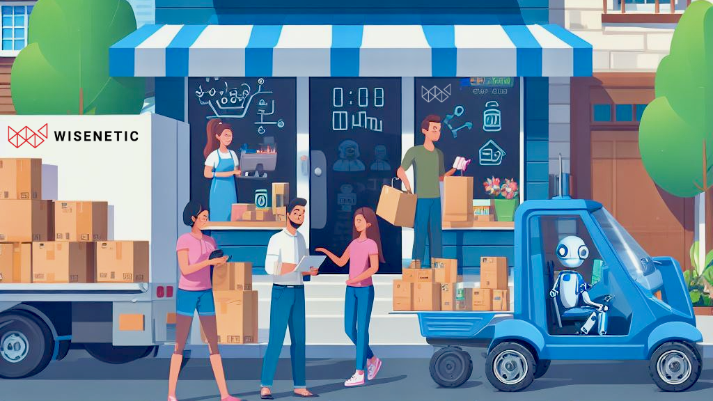

---

**Introduction:** In today's changing world, small businesses in emerging markets are discovering exciting opportunities for growth by combining the powers of online selling (e-commerce) and smart technology (artificial intelligence or AI). This blog will explore how these cool technologies are reshaping the way small businesses work, connect with customers, and succeed in emerging markets.

**The Rise of E-Commerce for Small Businesses:** local shops and small businesses are now setting up digital shops on the internet. People can now buy things online easily, and this is not only changing how people shop but is also giving smaller businesses a chance to compete better in the big market.

**Understanding AI in Small Business E-Commerce:** AI, once considered exclusive to large corporations, is now accessible to small businesses in emerging markets. Machine learning algorithms and data analytics empower these enterprises to understand their customers better, make data-driven decisions, and compete on a digital playing field.

**Personalization for Small Business Success:** Imagine going to a store where everything feels like it's just for you. Personalization is crucial for small businesses in emerging markets to capture the attention of diverse consumers. AI-driven tools enable personalized recommendations, tailoring the shopping experience to individual preferences and building stronger connections with customers.

**Chatbots and Virtual Assistants for Customer Engagement:** Resource constraints are common for small businesses, making it challenging to provide 24/7 customer support. AI-driven chatbots and virtual assistants bridge this gap, engaging with customers, answering queries, and enhancing the overall online shopping experience.

**AI in Supply Chain and Logistics Optimization:** Efficient supply chain management is critical for small business success in emerging markets. AI technologies help streamline logistics, reduce costs, and improve inventory management, enabling small businesses to compete effectively.

**Fraud Detection and Security for Trust:** Building trust is crucial for small businesses in emerging markets. AI plays a vital role in securing online transactions, detecting and preventing fraud, ensuring that customers feel confident when making purchases from smaller e-commerce players.

**Conclusion:** As small businesses in emerging markets learn to navigate the digital world, using e-commerce and AI together is like having a superpower. These technologies don't just make things fair for small businesses; they also create new paths for success. Small businesses can now stand out and succeed in the big, competitive market.

**Contact US :** [https://www.wisenetic.com/contact](https://www.wisenetic.com/contact)
