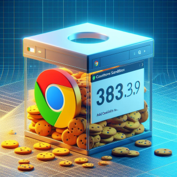

---

## Introduction

In the ever-evolving landscape of digital marketing, the impending end of third-party cookies has sent ripples across the online ecosystem. As major players in the tech industry prepare for this seismic shift, Google has taken the lead in crafting a more privacy-centric and user-friendly web experience. This blog post explores Google's proactive measures and the urgent steps website owners need to take as we approach the deprecation of third-party cookies.

## The Demise of Third-Party Cookies

Third-party cookies, those little pieces of data that track user behavior across different websites, have long been the backbone of online advertising. However, concerns about user privacy and the increasing wave of regulatory scrutiny have prompted companies to reevaluate their data practices. In response to this shifting landscape, Google announced its intention to phase out third-party cookies from its Chrome browser.

## The Countdown Begins:

### 1. Testing Phase Commences:

From January 4th, 2024, Google Chrome will disable third-party cookies for 1% of users to facilitate extensive testing. This phase is instrumental in identifying and resolving any potential issues before the broader implementation.

### 2. Ramp Up to 100% Users in Q3 2024:

The testing phase will gradually evolve, ramping up to 100% of Chrome users by the third quarter of 2024. However, this timeline is contingent upon addressing competition concerns raised by the UK's Competition and Markets Authority.

---

## Action Steps for Website Owners:

### 1. Audit Your Cookie Usage:

Conduct a comprehensive audit of your website to identify all instances where third-party cookies are currently utilized. This will provide a clear understanding of the areas that need adjustment.

### 2. Explore Alternatives:

In light of the impending changes, explore alternative solutions to replace the functionality of third-party cookies. Consider adopting privacy-preserving technologies.

### 3. Enhance First-Party Data Collection:

Emphasize the collection of first-party data through transparent and user-consented interactions. Building direct relationships with your audience will remain a key strategy in delivering personalized experiences without relying on third-party cookies.

### 4. Review Privacy Policies:

Ensure that your privacy policies are up-to-date and clearly communicate how user data is handled on your website. Transparency is crucial in maintaining trust with your audience.

### 5. Stay Informed on Industry Developments:

Given the evolving nature of digital privacy regulations, stay informed about industry developments and any updates from Google regarding the status of the third-party cookie deprecation. Flexibility and adaptability will be essential during this transition period.

### Conclusion :

As Chrome begins the testing phase for the deprecation of third-party cookies, website owners must act swiftly to adapt their strategies and technologies. By proactively auditing cookie usage, exploring alternative solutions, and enhancing first-party data collection, businesses can navigate this transition successfully. Stay vigilant, keep abreast of industry updates, and ensure that your online presence aligns with the forthcoming changes in the digital landscape. This preparation will not only enable a seamless transition but also uphold your commitment to user privacy and data transparency. Together, as an industry, we can embrace a new era of responsible and user-centric marketing in the evolving digital ecosystem.
