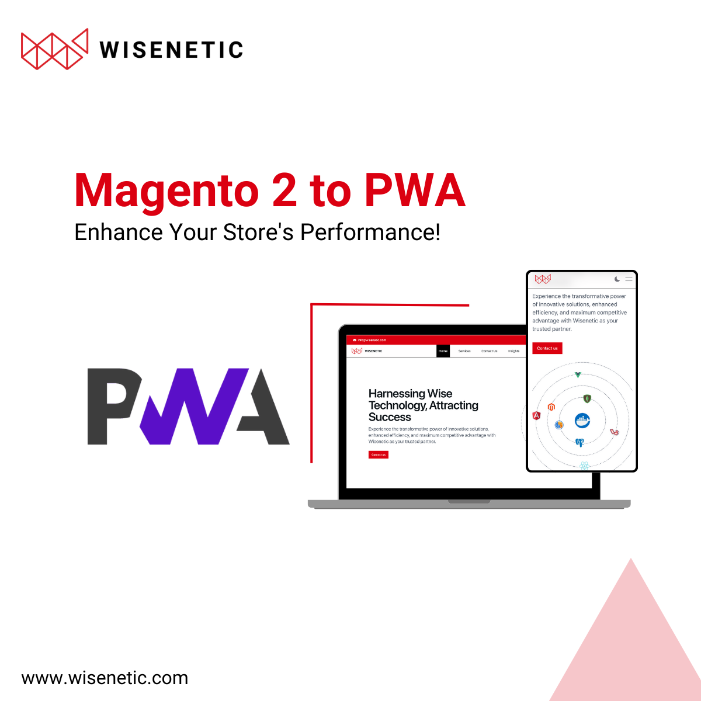

---

## Introduction

In the ever-evolving landscape of e-commerce, staying ahead of the curve is crucial for success. One of the latest trends that has gained significant traction is the adoption of Progressive Web Apps (PWAs). These applications combine the best of both worlds – the web and mobile applications – to deliver a seamless and engaging user experience. For Magento 2 store owners, the transition to a dynamic PWA is not just a trend; it's a strategic move to enhance performance, user engagement, and overall customer satisfaction.

## What is a Progressive Web App (PWA)?

Progressive Web Apps are web applications that leverage modern web technologies to provide a native-app-like experience. PWAs are known for their responsiveness, reliability, and speed, offering users an immersive experience similar to native mobile apps. Key features of PWAs include offline functionality, push notifications, and the ability to be installed on users' devices.

## Why Convert Your Magento 2 Store to a PWA?

### 1. Improved Performance:

PWAs are designed to load faster and perform more efficiently than traditional websites. By converting your Magento 2 store into a PWA, you ensure that users experience quick page loads and smooth interactions, leading to higher user satisfaction and retention.

### 2. Enhanced User Experience:

PWAs provide a seamless and engaging user experience. The ability to work offline and the responsiveness of the application contribute to a more enjoyable shopping experience for customers. PWAs also eliminate the need for users to download and install large applications, making the process more user-friendly.

### 3. Increased Conversions:

Faster loading times and a smoother user experience contribute to higher conversion rates. Studies have shown that even a one-second delay in page load time can result in a significant drop in conversions. By optimizing your Magento 2 store as a PWA, you can positively impact your conversion rates and ultimately boost sales.

### 4. Cross-Platform Compatibility:

PWAs work seamlessly across various devices and platforms. Whether your customers are accessing your store on a desktop, tablet, or mobile device, a PWA ensures a consistent and optimized experience.

---

## Steps to Convert Your Magento 2 Store to a PWA:

### 1. Select a PWA Studio:

Choose a PWA studio that aligns with your business requirements. Magento's PWA Studio is a popular choice, providing a set of tools and development practices for building a PWA on top of your existing Magento 2 store.

### 2. Install and Configure PWA Studio:

Install the PWA Studio on your Magento 2 store and configure it according to your preferences. This may involve adjusting themes, styles, and other settings to create a seamless integration with your brand.

### 3. Optimize for Performance:

Ensure that your PWA is optimized for performance. This includes optimizing images, minimizing code, and implementing caching strategies to enhance page load times.

### 4. Enable Push Notifications:

Take advantage of push notifications to keep your customers informed about promotions, discounts, and new product arrivals. Push notifications can help re-engage users and drive repeat business.

### 5. Test and Debug:

Thoroughly test your PWA across different devices and browsers to ensure a consistent and bug-free experience. Address any issues or bugs that arise during testing to guarantee a smooth transition for your customers.

### 6. Launch and Monitor:

Once you are satisfied with the performance and functionality of your PWA, launch it to the public. Monitor user feedback and analytics to make continuous improvements and enhancements.

---

### Conclusion

Transforming your Magento 2 store into a dynamic Progressive Web App is a strategic investment that can significantly impact your business's success in the digital era. By focusing on improved performance, enhanced user experience, and increased conversions, you position your store to meet the evolving expectations of online shoppers. Embrace the future of e-commerce with a PWA and provide your customers with a seamless, responsive, and engaging shopping experience.
